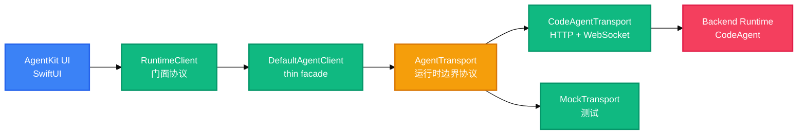

<!-- AUTO-GENERATED -->
<h1 align="center">AgentKit</h1>
<p align="center">
  <strong>为 Apple 平台构建现代 AI Agent 应用的 Swift 框架。</strong>
  <br />
  <em>Swift · SwiftUI · iOS 18+ · macOS 15+ · 多 Runtime · 事件溯源</em>
</p>

<p align="center">
  <a href="#快速开始"></a>
  <a href="LICENSE"></a>
</p>

<p align="center">
  
  
  
  
  
  
</p>

AgentKit 是一个开源的 Swift 框架，用于在 iOS 和 macOS 上构建生产级的 AI Agent 应用。它**不是**聊天 UI 组件库，而是一套**多 Runtime 执行图系统**：以协议优先的方式将 UI 渲染与后端 Agent Runtime 解耦，UI 只依赖 `RuntimeClient` 协议，backend 通过 `AgentTransport` 边界协议可插拔替换。

## 特性

| 特性 | 说明 |
|---|---|
| 协议优先 | UI 只依赖 `RuntimeClient` 门面协议，不接触任何 HTTP / WebSocket 实现 |
| Transport 可插拔 | `AgentTransport` 是 UI 与 backend 之间的唯一边界；替换 `CodeAgentTransport` 即可接入其他 Runtime |
| 会话归服务端所有 | `ConversationRef` 是服务端持有的会话身份；`connect()` 是 attach 而非 create |
| 事件是唯一事实来源 | `RuntimeEngine` actor 单点 ingest `AgentEvent`，经 reducer 投影后发布不可变的 `RuntimeSnapshot` |
| UI 无业务逻辑 | UI 只做渲染、动画与交互；不自行 reduce 事件 |
| 异步审批 | approval / plan approval / ask_user 走独立异步事件通道，支持三态决策与作用域 |

## 快速开始

### 依赖

- Swift 6.2+，iOS 18+ / macOS 15+

### 安装

在 `Package.swift` 中添加依赖（以下为本地路径示例；发布后替换为仓库 URL）：

```swift
dependencies: [
    .package(path: "/path/to/AgentKit"),
]
```

### 连接外部 Runtime

```swift
import AgentKit

// 1. 创建指向 backend 的 transport（CodeAgent 参考实现）
let transport = CodeAgentTransport(
    environment: RuntimeEnvironment(host: "127.0.0.1", port: 8797)
)

// 2. 创建 thin facade client
let client = DefaultAgentClient(transport: transport)

// 3. 注入 UI 依赖
let deps = AgentDependencies(client: client)
```

### 使用内嵌 Runtime

```swift
// 自动读取 AgentRuntime.shared 的动态端口并注入进程内访问凭据
let client = DefaultAgentClient.fromRuntime()
```

## 用法

### 发送结构化输入

`AgentInput` 不是「用户消息」，而是 execution graph 的 continuation edge：

```swift
await client.send(input: .text("分析这个项目"))

await client.send(input: .toolResult(ToolResultContent(
    toolUseID: "call_1",
    content: "File contents...",
    isError: false
)))
```

### 连接事件流（断线续传）

```swift
// since = 已回放历史里最大的 seq；重连后自动补齐缺口再放行直播帧
let events = try await client.connect(conversationID: id, since: 0)
for await event in events {
    // reducer 消费事件，UI 订阅 RuntimeSnapshot
}
```

### 异步审批

```swift
// 两态
await client.sendApproval(id: approvalID, approved: true)
// v1.2 三态：decision = "once" | "always" | "deny"；scope 仅 "always" 有效
await client.sendApproval(id: approvalID, decision: "always", scope: "user")
```

### 会话管理

```swift
let ref = try await client.createConversation(workspacePath: "/path/to/project")
try await client.renameConversation(id: ref.id, name: "重构任务")
try await client.archiveConversation(id: ref.id)
```

## 架构

```
┌──────────────────────────────────────────┐
│            AgentKit UI (SwiftUI)          │
│   只依赖 RuntimeClient / RuntimeSnapshot  │
└──────────────┬───────────────────────────┘
               │ RuntimeClient (facade protocol)
               ▼
┌──────────────────────────────────────────┐
│          DefaultAgentClient              │  ← thin facade，零业务逻辑
│        (组合 AgentTransport)              │
└──────────────┬───────────────────────────┘
               │ AgentTransport (runtime boundary protocol)
               ▼
┌──────────────────────────────────────────┐
│ CodeAgentTransport · DreamAITransport    │  ← backend 实现，可插拔
│ MockTransport (测试)                     │
└──────────────┬───────────────────────────┘
               ▼
┌──────────────────────────────────────────┐
│            Backend Runtime                │
│   (CodeAgent / 其他 Agent Runtime)        │
└──────────────────────────────────────────┘
```



客户端内部采用**事件溯源**架构：`RuntimeEngine`（actor）是唯一状态持有者，单点 ingest `AgentEvent`，经 `ExecutionReducer` 变更 `ExecutionGraph`，再投影为 `TimelineProjection` 与 `ExecutionPresentation` 供 SwiftUI 消费——视图不接触原始 Graph，也不自行 reduce。

## 配置

随包分发的内嵌 Runtime 配置位于 `Sources/AgentKit/Resources/config.yaml`，关键项如下：

| 配置项 | 说明 | 默认值 |
|---|---|---|
| `default_model` | 默认模型（走 Gateway） | `gateway` |
| `credentials.gateway.*.source` | 登录态凭据来源，经 Keychain 注入 | `injected` |
| `credentials.llm.*` | 直连模型的环境变量密钥（仅引用变量名，不含明文） | `DEEPSEEK_API_KEY` 等 |
| `agent.max_steps` | 单 turn 最大执行步数 | `33` |
| `agent.max_parallel_tools` | 并行工具上限 | `4` |
| `provider.request_timeout_seconds` | Provider 请求超时 | `600` |
| `runtime.max_concurrent_turns` | 最大并发 turn 数 | `5` |

`AgentDependencies` 提供 host 侧注入点：`onAuthExpired`（刷新 token 后重配 Runtime）、`timelineExtensions`、`userAssetPicker` / `localUserAssetStager` 等。

## 核心协议 API

| 类型 / 方法 | 职责 |
|---|---|
| `RuntimeClient` | UI 消费 Agent Runtime 的唯一入口门面协议 |
| `AgentTransport` | 运行时边界协议；backend 实现方遵循 |
| `RuntimeSessionChannel` | 绑定到单个会话的独立控制通道 |
| `AgentInput` | 结构化输入：`.text` / `.toolResult` / `.command` / `.system` |
| `AgentEvent` / `RuntimeSnapshot` | 事件流与不可变 UI 快照（含 timeline、审批队列、todo、model stats） |
| `ConversationRef` | 服务端持有的会话身份 |
| `registerTools(_:)` | 向服务端注册客户端可执行工具（`ClientToolProtocol`） |
| `getEventBatch` / `openJobStream` / `openChildStream` | 历史回放与 job / 子流实时读取 |
| `getWorkflowSnapshot` | 一次取齐 DAG 拓扑 + 全部节点状态 |
| `getAssetPreview` / `getAssetContent` | 结构化 Artifact 预览与全文内容 |
| `cloneRepo(request:)` | 使用 Runtime 持有的项目根克隆公开 Git 仓库 |

完整 wire 协议见 `docs/protocols/`（agent-wire v1 / v1.1 / v1.2 / v1.3 / v1.5）与 `docs/agent-gateway-api/`。

## 项目结构

```
AgentKit/
├── Sources/AgentKit/
│   ├── Core/                  # RuntimeClient、AgentTransport、AgentInput、事件溯源引擎
│   │   ├── RuntimeEngine/     # ExecutionGraph / Reducer / TimelineProjection / MergePolicy
│   │   ├── RuntimeServers/    # 内嵌与外部 Runtime Server 连接、TLS、状态监控
│   │   ├── RuntimeSharing/    # Bonjour 配对与跨设备 Runtime 共享
│   │   ├── Credential/        # Keychain / Memory / Composite 凭据存储
│   │   ├── Providers/         # Provider 连接、模型目录、Runtime 配置应用
│   │   ├── Artifact/          # Artifact 图、语义映射、摘要渲染
│   │   └── Workflow/          # DAG 工作流模型与存储
│   ├── Features/
│   │   ├── Conversation/      # 对话、流式 Markdown 渲染、审批、Todo、Inspector
│   │   ├── Inspector/         # 文件 / Diff / 终端 / Todo 检查器
│   │   ├── Workspace/         # 项目、最近工作区、workspace 状态
│   │   └── Workflow/          # DAG 卡片、布局与节点详情视图
│   ├── Navigation/            # AgentDependencies、Router、导航目标
│   └── Resources/             # config.yaml、skills/、ConversationWeb、Localizable
├── Examples/CodeAgent/        # macOS / iOS 原生示例客户端
├── Web/ConversationWorkbench/ # React + TypeScript Web 工作台
├── Tests/AgentKitTests/       # 协议、引擎、凭据、工作流等测试
└── docs/                      # 协议规范与设计文档
```

## 技术栈

| 层次 | 技术 | 用途 |
|---|---|---|
| 语言 | Swift 6.2（严格并发，actor） | 框架主体 |
| UI | SwiftUI | 对话、检查器、工作台界面 |
| 通信 | WebSocket / HTTP | Agent Wire 协议与 Runtime HTTP API |
| 存储 | SQLite（内建） | 会话本地状态、注意力游标等持久化 |
| 依赖 | swift-markdown · ClientToolProtocol | Markdown 渲染与客户端工具协议 |
| Runtime | CodeAgentRuntime（XCFramework） | iOS / macOS 内嵌 Runtime |
| Web | React 19 · Vite · TypeScript | ConversationWorkbench 示例工作台 |

## 贡献

1. Fork 本仓库
2. 创建特性分支（`git checkout -b feature/amazing`）
3. 提交改动（遵循 Conventional Commits，如 `feat: ...` / `fix: ...`）
4. 推送分支（`git push origin feature/amazing`）
5. 提交 Pull Request

## 许可

[MIT](LICENSE) © 2026 Ivan Yang
<!-- BEAUTIFIED -->
